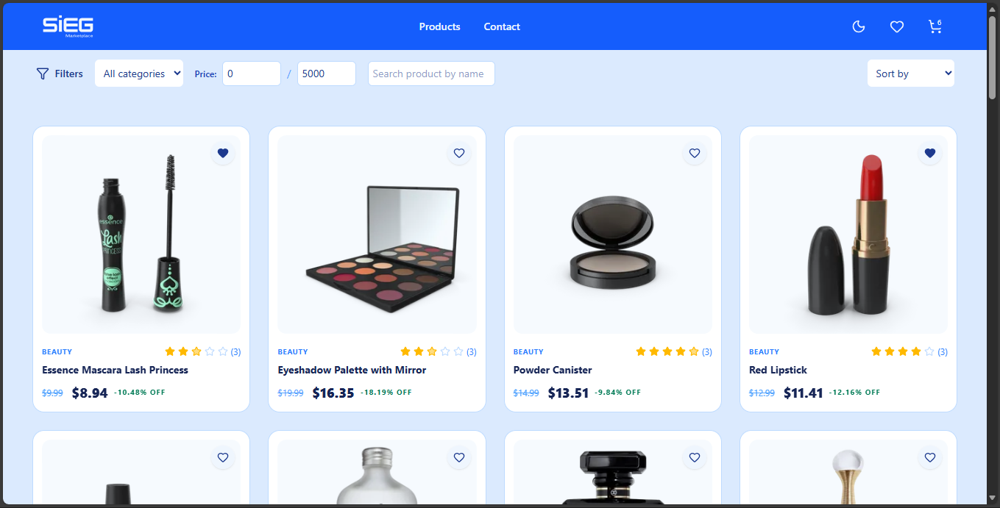
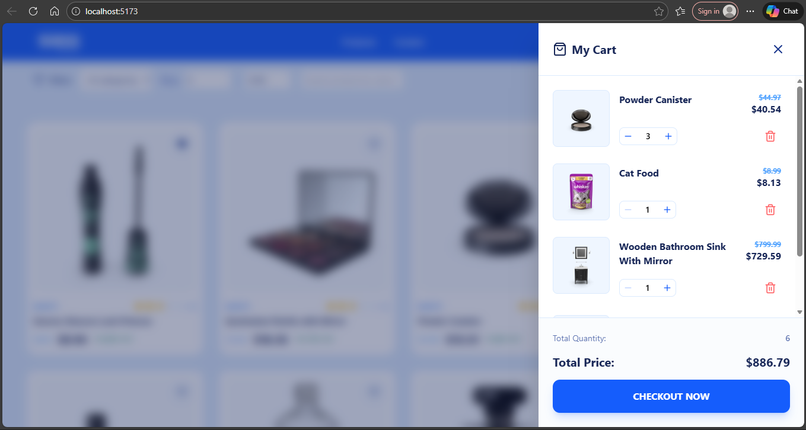
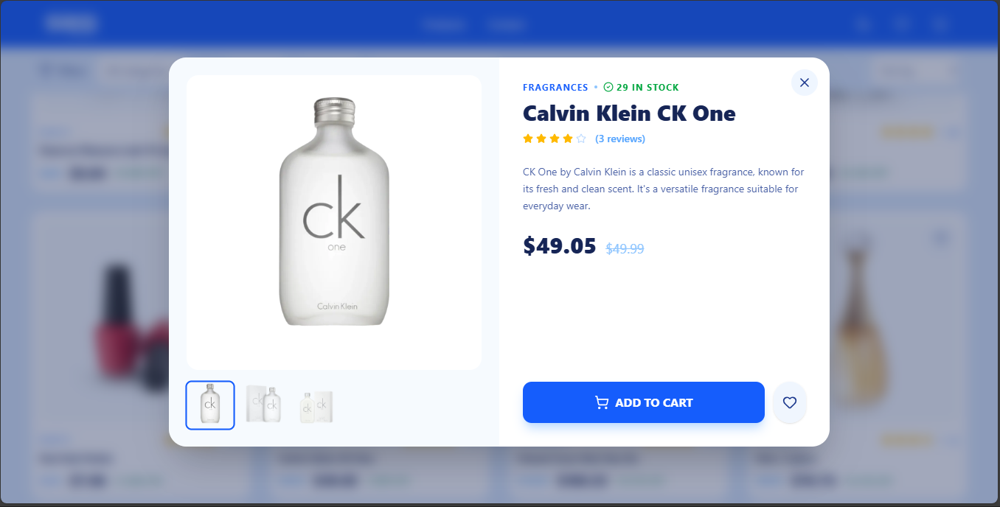

# SIEG Challenge

 
 
 

## Overview

**Aplicação SPA** de catálogo de produtos com favoritos, carrinho, filtros e busca com debounce.

Foco em **performance**, **simplicidade**, **UX mobile-first** e **código testável**.

Live demo: https://sieg-test.vercel.app/

---

## Stack

- React 19 + Vite
- TypeScript
- TailwindCSS
- Context API
- Vitest + Testing Library
- localStorage (persistência)

---

## Como rodar

```bash
  git clone https://github.com/jpedromergulhao/sieg-test
  cd sieg-test
  npm install
  npm run dev
```  

### Testes:

```bash
  npm run test
  npm run test:ui
``` 

### Build:

```bash
  npm run build
``` 

---

## Decisões técnicas

### SPA sem router

O desafio **não exige** múltiplas páginas. Usei modal + estado local para simplificar UX e reduzir complexidade.

### products.json local (offline-first)

Em vez de consumir a API diretamente:
- evita instabilidade externa
- roda 100% offline
- testes mais previsíveis
- melhor performance

Simulei latência de rede com: `setTimeout(300)`

O payload é uma **cópia do DummyJSON**, porém limpo via script: `node scripts/clean-products.cjs`

Mantive apenas os campos necessários.

### Context API (estado global simples)

Como o projeto possui:
- poucas actions
- baixo acoplamento
- lógica simples

Context + useState é suficiente. Redux/Reducer seria **overengineering** aqui.

Usado para:
- favoritos
- carrinho
- loading
- UI state

### Debounce manual na busca

Input com debounce de 300ms para:
- reduzir re-render
- evitar filtros a cada tecla
- UX mais suave

### Persistência

localStorage para:
- favoritos
- carrinho
- darkmode

Mantém estado entre reloads.

---

## Testes

Vitest + Testing Library (melhor integração com Vite do que Jest).

### Hook

**`useProducts.test.ts`**
- lifecycle
- async
- loading state
- isolamento do hook

### Componente

**`ProductCard.test.tsx`**
- clique no coração → adiciona favorito
- renderização
- interação do usuário
- contexto mockado

### Helper

**`productFilter.test.ts`**
- filtro por categoria
- filtro por preço
- busca + debounce

---

## Estrutura de pastas

```text
data/           # JSONs usados pela app
scripts/        # utilitários (clean-products)
src/
 ├─ components/ # UI reutilizável
 ├─ hooks/      # lógica compartilhada
 ├─ context/    # estado global
 ├─ helpers/    # funções puras (filtros)
 ├─ types/      # tipos globais
 ├─ test/       # testes
 ├─ App.tsx
 └─ main.tsx
```

---

## Payload simplificado

Mantive apenas dados relevantes para **melhorar performanc** e **reduzir complexidade**:

```text
{
  id,
  title,
  description,
  price,
  rating,
  reviewCount,
  category,
  thumbnail,
  images,
  stock,
  discountPercentage
}
```

---

## O que priorizei

- performance
- simplicidade
- UX mobile-first
- acessibilidade
- código limpo
- testabilidade

---

## O que faria com mais tempo

- paginação ou infinite scroll
- testes e2e (Playwright/Cypress)
- animações micro-interações
- reducer ou Zustand se a lógica crescer
- Storybook para documentação de componentes
- deploy automatizado (CI/CD)

---

## Observações finais

A arquitetura foi mantida intencionalmente simples, priorizando clareza e manutenção, evitando
abstrações desnecessárias para o escopo do desafio.

O objetivo foi entregar um código:
- previsível
- fácil de testar